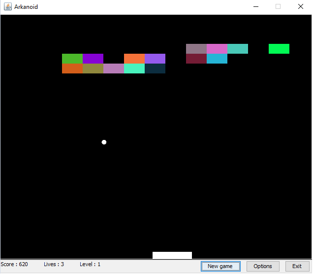
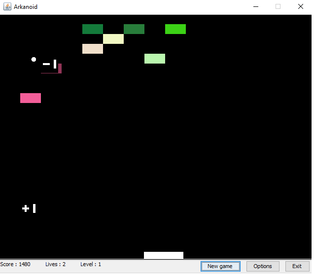
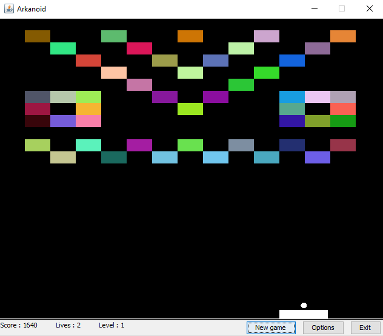

# Arkanoid

Implementation of Arkanoid game in Java. 
Game was written by me in October 2009. 

The game has 4 levels that are described in levels.xml file. 
You can add as many new levels as you like, but pay attention to xml syntax and (x,y) coords.

Speed of ball increases over time.  
Game also has some bonuses like:
<ul>
    <li>Life + / Life -</li>
    <li>Ball speed up / Ball speed down</li>
    <li>Add extra ball</li>
    <li>Increase / Decrease stick length</li>
    <li>Increase / Decrease ball radius</li>
</ul>

Screenshots:

